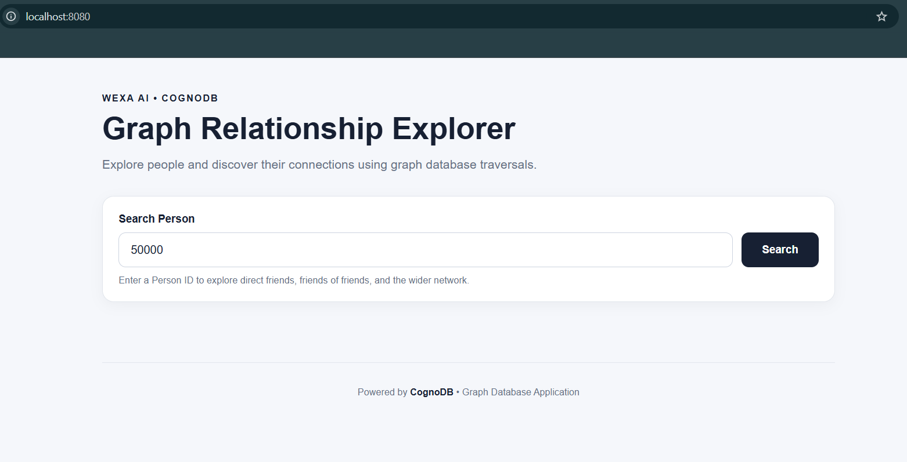
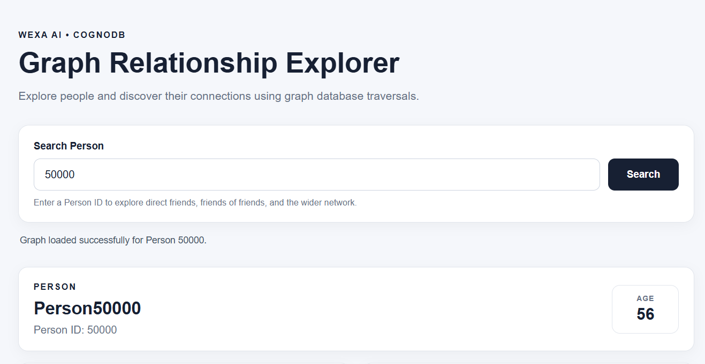
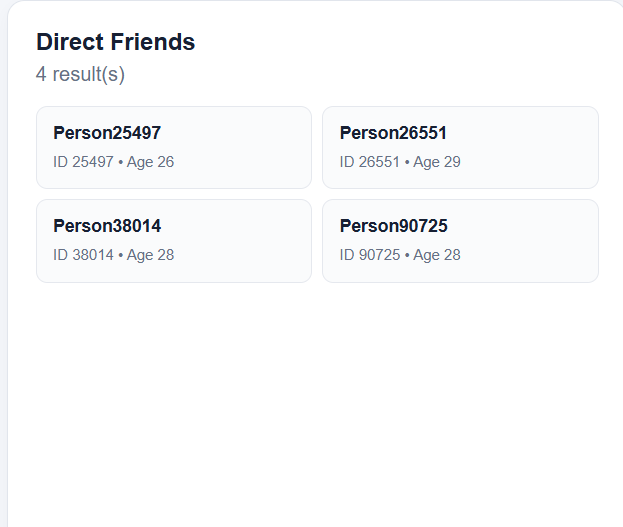
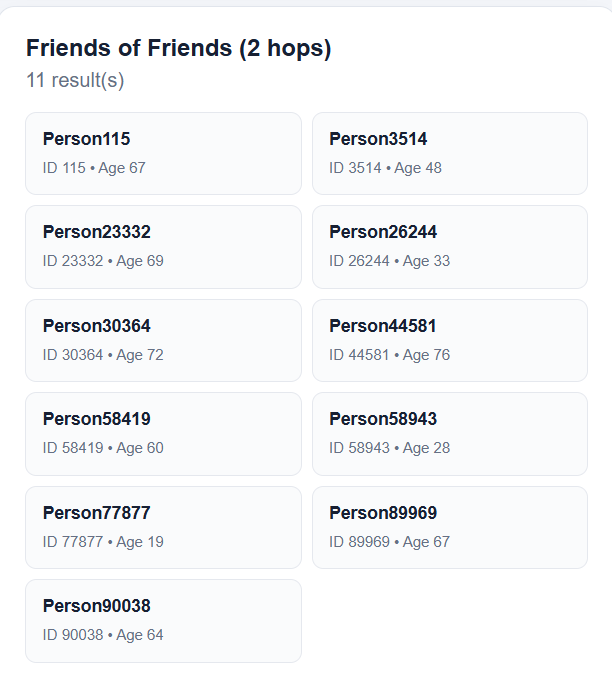
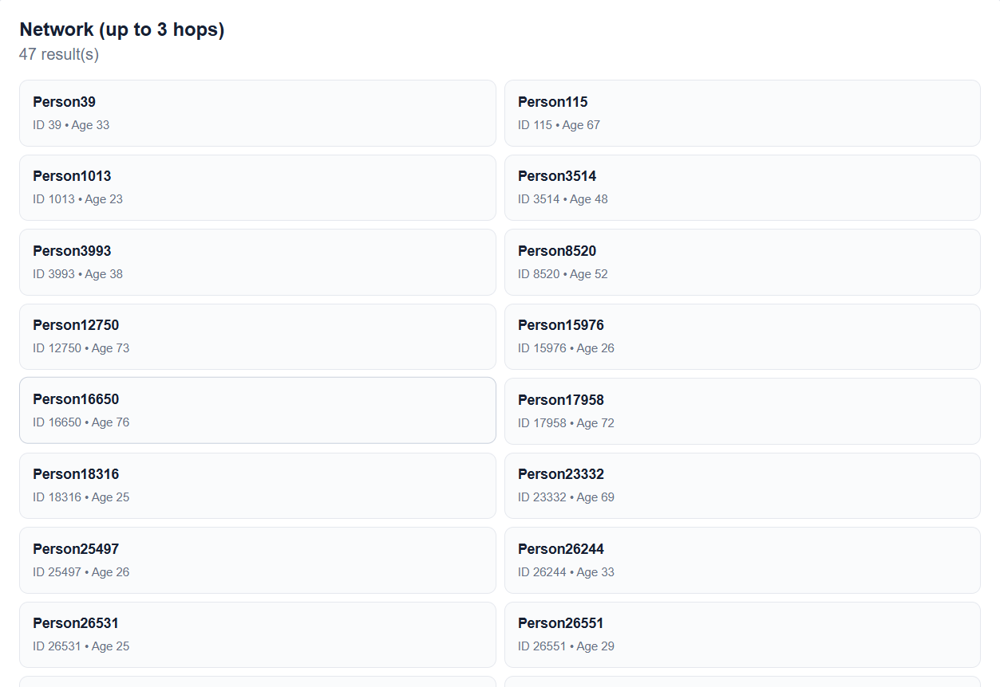

# CognoDB Graph Relationship Explorer

A small web application backed by **CognoDB** that allows a non-technical user to explore a Person graph and discover relationships between people through graph traversals.

The application provides:

- Person lookup by ID
- Direct friend traversal
- Friends-of-friends traversal up to 2 hops
- Wider network traversal up to 3 hops
- Result counts
- Loading/status messages
- Empty-result handling
- Database error handling
- Responsive web interface

---

# 1. Project Overview

The CognoDB Graph Relationship Explorer demonstrates how a graph database can be used to explore relationships between people.

The application is built using:

- Java 17
- Spring Boot 3.5.5
- CognoDB
- Neo4j Java Driver 5.28.5
- openCypher
- HTML
- CSS
- JavaScript
- Maven
- Docker

The backend exposes REST APIs and communicates with CognoDB using the Neo4j Java Driver.

The frontend provides a simple interface where a user can enter a Person ID and explore the person's connections.

---

# 2. Use Case

The selected use case is a **Person Relationship Explorer**.

A user can search for a person and answer questions such as:

- Who is this person's direct friend?
- Who are this person's friends of friends?
- Which people are connected within three relationship hops?
- How large is the person's local network?

This type of relationship traversal is naturally represented using a graph database.

---

# 3. Why a Graph Database?

The application is centered on relationships between people.

Questions such as:

> Who are this person's friends of friends?

require traversing multiple relationships.

In a relational database, this type of query may require multiple self-joins and becomes increasingly complex as the traversal depth increases.

In a graph database:

- People are represented as nodes.
- Relationships are represented directly as edges.
- Traversals can follow relationships directly.
- Variable-length paths can be expressed naturally using openCypher.

For this application, the relationship is represented as:

```text
(:Person)-[:FRIEND]->(:Person)
```

This makes multi-hop relationship traversal natural to express using openCypher.

---

# 4. Graph Data Model

The application uses the following graph model:

```text
(:Person)-[:FRIEND]->(:Person)
```

Each `Person` contains:

```text
Person
├── id
├── name
└── age
```

Example:

```cypher
(:Person {
    id: 50000,
    name: "Person50000",
    age: 56
})
```

People are connected using:

```text
(:Person)-[:FRIEND]->(:Person)
```

Example:

```text
Person50000
     |
     | FRIEND
     v
Person25497
```

---

# 5. Graph Traversals

## 5.1 1-Hop - Direct Friends

```cypher
MATCH (p:Person {id: $id})-[:FRIEND]->(f:Person)
RETURN f.id AS id, f.name AS name, f.age AS age
ORDER BY f.id
LIMIT 50
```

## 5.2 2-Hop - Friends of Friends

```cypher
MATCH (p:Person {id: $id})-[:FRIEND]->()-[:FRIEND]->(f:Person)
WHERE f.id <> $id
RETURN DISTINCT
       f.id AS id,
       f.name AS name,
       f.age AS age
ORDER BY f.id
LIMIT 50
```

## 5.3 Up to 3-Hop Network

```cypher
MATCH (p:Person {id: $id})-[:FRIEND*1..3]->(f:Person)
WHERE f.id <> $id
RETURN DISTINCT
       f.id AS id,
       f.name AS name,
       f.age AS age
ORDER BY f.id
LIMIT 100
```

This retrieves people reachable within one, two, or three `FRIEND` relationships.

---

# 6. Relationally Awkward Query

A key graph query in this application is the variable-depth traversal:

```cypher
MATCH (p:Person {id: $id})-[:FRIEND*1..3]->(f:Person)
WHERE f.id <> $id
RETURN DISTINCT
       f.id AS id,
       f.name AS name,
       f.age AS age
ORDER BY f.id
LIMIT 100
```

This finds people reachable from a starting person within one to three relationship hops.

In a relational database, an equivalent variable-depth traversal would require multiple self-joins or separate query logic for each relationship depth. Increasing the traversal depth would make the query more complex.

In CognoDB, the variable-length path:

```cypher
[:FRIEND*1..3]
```

directly expresses the traversal.

This is one of the main reasons a graph database is appropriate for this use case.

---

# 7. Parameterized Queries

All application queries use parameters instead of directly concatenating user input into Cypher.

Example:

```cypher
MATCH (p:Person {id: $id})
RETURN p.id AS id, p.name AS name, p.age AS age
```

The parameter is supplied by the Neo4j Java Driver:

```java
Values.parameters("id", id)
```

This keeps user input separate from the Cypher query structure.

---

# 8. Application Architecture

```text
                    Web Browser
                         |
                         v
                   HTML / CSS / JS
                         |
                         v
                  PersonController
                         |
                         v
                    PersonService
                         |
                         v
                  PersonRepository
                         |
                         v
                  Neo4j Java Driver
                         |
                         v
                       CognoDB
```

- **PersonController.java** - exposes REST endpoints.
- **PersonService.java** - service layer between controller and repository.
- **PersonRepository.java** - contains the Cypher queries.
- **CognoDbConfig.java** - configures the CognoDB connection.
- **SeedData.java** - loads the required graph dataset when needed.

---

# 9. Project Structure

```text
CognoDB-Graph-Relationship-Explorer/
│
├── src/
│   ├── main/
│   │   ├── java/
│   │   │   └── com/wexa/cognograph/
│   │   │       ├── CognoGraphApplication.java
│   │   │       ├── config/
│   │   │       │   └── CognoDbConfig.java
│   │   │       ├── controller/
│   │   │       │   └── PersonController.java
│   │   │       ├── repository/
│   │   │       │   └── PersonRepository.java
│   │   │       ├── service/
│   │   │       │   └── PersonService.java
│   │   │       └── seed/
│   │   │           └── SeedData.java
│   │   └── resources/
│   │       ├── datasets/
│   │       │   ├── person.csv
│   │       │   └── person_knows_person.csv
│   │       ├── static/
│   │       │   ├── index.html
│   │       │   ├── style.css
│   │       │   └── app.js
│   │       └── application.properties
│   └── test/
│
├── Dockerfile
├── pom.xml
└── README.md
```

---

# 10. Technologies Used

| Technology | Purpose |
|---|---|
| Java 17 | Backend programming language |
| Spring Boot 3.5.5 | Web application framework |
| CognoDB | Graph database |
| Neo4j Java Driver 5.28.5 | Database connectivity |
| openCypher | Graph query language |
| HTML | Web page structure |
| CSS | User interface styling |
| JavaScript | Frontend interaction |
| Maven | Project/build management |
| Docker | Deployment packaging |

---

# 11. CognoDB Setup

1. Create or sign in to a CognoDB account.
2. Open the CognoDB console.
3. Create a free CognoDB instance.
4. Save the generated connection details and password securely.

The connection URI has the following form:

```text
bolt+s://<instance-id>.databases.cognodb.cloud
```

The database username is:

```text
cognodb
```

Do not commit the password to GitHub.

---

# 12. Environment Variables

Set:

```text
COGNODB_URI=bolt+s://<instance-id>.databases.cognodb.cloud
COGNODB_USERNAME=cognodb
COGNODB_PASSWORD=<your-password>
```

Never commit real database credentials to GitHub.

The Spring Boot configuration uses:

```properties
cognodb.uri=${COGNODB_URI}
cognodb.username=${COGNODB_USERNAME}
cognodb.password=${COGNODB_PASSWORD}
```

---

# 13. Dataset and Seed Data

The application uses a Person graph dataset containing Person nodes and `FRIEND` relationships.

CSV files are under:

```text
src/main/resources/datasets/
```

Files:

```text
person.csv
person_knows_person.csv
```

The repository includes:

```text
com.wexa.cognograph.seed.SeedData
```

The seed process provides a repeatable way to create the required graph data when the target CognoDB instance needs it.

Before running the seed process:

1. Configure the CognoDB connection.
2. Ensure the correct credentials are available.
3. Ensure the CSV files are present.
4. Ensure the target database is intended to receive the seed data.

If the target database already contains the required dataset, the existing data can be reused.

---

# 14. Running the Application Locally

## Clone

```bash
git clone https://github.com/Mahalakshmi-2105/CognoDB-Graph-Relationship-Explorer.git
cd CognoDB-Graph-Relationship-Explorer
```

## Configure CognoDB

Set:

```text
COGNODB_URI
COGNODB_USERNAME
COGNODB_PASSWORD
```

## Build

```bash
mvn clean package
```

## Run

```bash
mvn spring-boot:run
```

Or run `CognoGraphApplication.java` from Eclipse.

Open:

```text
http://localhost:8080
```

---

# 15. Using the Web Application

Enter a Person ID, for example:

```text
50000
```

and click **Search**.

The application displays the person and:

- Direct Friends
- Friends of Friends (2 hops)
- Network (up to 3 hops)

Example person:

```text
Person50000
Person ID: 50000
Age: 56
```

---

# 16. REST API

### Person Lookup

```text
GET /api/person/{id}
```

Example:

```text
GET /api/person/50000
```

### Direct Friends

```text
GET /api/person/{id}/friends
```

### Friends of Friends

```text
GET /api/person/{id}/friends-of-friends
```

### Network

```text
GET /api/person/{id}/network
```

---

# 17. Example Test Results

The application was tested using Person ID `50000`.

Person lookup:

```text
ID   : 50000
Name : Person50000
Age  : 56
```

Direct friend traversal:

```text
4 results
```

Friends-of-friends traversal:

```text
11 results
```

Network traversal up to three hops:

```text
47 results
```

These results demonstrate that the application successfully retrieves graph relationships from CognoDB.

---

# 18. Error Handling

If CognoDB cannot be reached or a query fails, the application returns an internal server error with a user-friendly message.

Example:

```json
{
  "error": "Unable to reach or query CognoDB",
  "message": "Please check the database connection and try again."
}
```

The frontend also provides:

```text
Loading graph data...
Graph loaded successfully.
No connections found.
Person not found.
```

---

# 19. UI Features

- Person ID search
- Person profile information
- Age display
- Direct friend results
- 2-hop friend results
- 3-hop network results
- Result counts
- Loading/status message
- Empty state
- Error message
- Responsive layout

The UI is implemented using HTML, CSS, and JavaScript.

---

# 20. Data Flow

```text
User enters Person ID
          |
          v
     Web Browser
          |
          v
     REST Request
          |
          v
   PersonController
          |
          v
     PersonService
          |
          v
   PersonRepository
          |
          v
     Cypher Query
          |
          v
       CognoDB
          |
          v
     Query Results
          |
          v
     REST Response
          |
          v
     Web Browser
```

---

# 21. Security Considerations

Database credentials are not stored directly in source code.

The application uses:

```text
COGNODB_URI
COGNODB_USERNAME
COGNODB_PASSWORD
```

Cypher queries use parameters such as `$id` instead of concatenating user input into queries.

Real credentials must never be committed to GitHub.

---

# 22. Deployment

The application is containerized using Docker and deployed on **Render** as a Docker-based Web Service.

The project contains:

```text
Dockerfile
```

Render is configured with:

```text
COGNODB_URI
COGNODB_USERNAME
COGNODB_PASSWORD
```

The credentials are configured in Render and are not stored in GitHub.

Deployment flow:

```text
GitHub Repository
       |
       v
     Render
       |
       v
 Docker Build
       |
       v
 Java 17 / Spring Boot
       |
       v
    CognoDB
```

---

# 23. Hosted Demo

The application has been deployed successfully on Render and verified using the live web application.

**Live Demo:** https://cognodb-graph-relationship-explorer.onrender.com/

The hosted application connects to CognoDB using the configured Render environment variables.

---

# 24. Screenshots

The following screenshots demonstrate the working application.

### 24.1 Application Home Page



### 24.2 Person Details



### 24.3 Direct Friends



### 24.4 Friends of Friends - 2 Hops



### 24.5 Network - Up to 3 Hops



These screenshots show the application searching for Person `50000`, displaying the person's details, direct friends, 2-hop friends, and the wider network up to 3 hops.

---

# 25. Demo Recording

The short recording should demonstrate:

1. Opening the application.
2. Searching for a Person.
3. Viewing Person details.
4. Viewing direct friends.
5. Viewing 2-hop friends.
6. Viewing the 3-hop network.
7. Showing the application working with CognoDB.

Demo Recording:

```text
https://drive.google.com/file/d/15IS16HR2fF8NEPRn7fXvG6nzJwhERnC_/view?usp=sharing
```

Replace the placeholder with the actual recording link before submission.

---

# 26. GitHub Repository

The complete project is available at:

https://github.com/Mahalakshmi-2105/CognoDB-Graph-Relationship-Explorer

The repository contains the Java source code, web interface, dataset files, seed mechanism, Dockerfile, configuration, and documentation.

---

# 27. Limitations

The current application is intentionally small and focused on demonstrating graph traversal.

Current limitations include:

- The application focuses on Person and FRIEND relationships.
- Results are limited to a fixed number of records.
- The network view returns relationship results rather than a visual node-link graph.
- Authentication is not implemented.
- The application depends on the configured CognoDB instance.
- The application is intended as a graph traversal demonstration rather than a production-scale social networking platform.

---

# 28. Future Improvements

Possible future enhancements include:

- Interactive visual graph rendering
- Clickable Person nodes
- Dynamic traversal depth selection
- Relationship type filtering
- Search by name
- Pagination
- User authentication
- Caching
- More detailed graph analytics
- Monitoring and logging
- Additional automated tests

---

# 29. Assignment Deliverables

The project provides:

- Working CognoDB-backed application
- Seed/data-loading mechanism
- Graph data model
- Explanation of why a graph database is appropriate
- Parameterized Cypher queries
- Multi-hop graph traversal
- A relationally awkward variable-depth traversal
- Functional web interface
- Loading state
- Empty state
- Error handling
- README documentation
- UI screenshots
- Docker deployment configuration
- Hosted demo
- Short screen recording
- Public GitHub repository

---

# 30. Final Verification Checklist

Before submission:

- [x] Application starts successfully
- [x] CognoDB connection works
- [x] Person lookup works
- [x] Direct friends query works
- [x] 2-hop query works
- [x] 3-hop/network query works
- [x] Parameterized Cypher is used
- [x] Error handling is implemented
- [x] Loading/status message is implemented
- [x] Empty state is implemented
- [x] UI is responsive
- [x] SeedData is present
- [x] Dataset files are present
- [x] No real credentials are committed
- [x] README documentation is complete
- [x] Actual screenshots are referenced in the README
- [x] Application is deployed
- [x] Exact Render hosted URL is added
- [x] Demo recording public link is added (if required by the submission portal)
- [x] GitHub repository is public

---

# 31. Author

**Mahalakshmi**

Graph Relationship Explorer using **CognoDB, Spring Boot, Java 17, and openCypher**.
